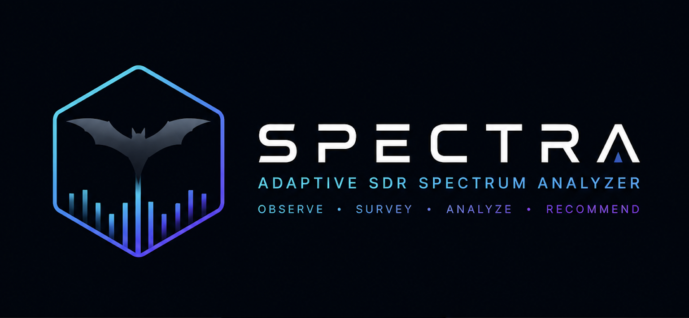

<p align="center">
  
</p>

# SPECTRA

*Adaptive SDR Spectrum Analyzer*

**Spectrum Processing, Evaluation, Classification, Tracking, Ranking, and Analysis**

SPECTRA is an adaptive SDR spectrum analyzer and explainable RF survey system
designed to help engineers observe, characterize, and evaluate RF environments
using live spectrum analysis and automated frequency surveys. It receives
complex IQ samples from an RTL-SDR, displays a real-time FFT and waterfall,
detects and tracks candidate RF activity, measures spectral-bin occupancy and
observed signal behavior, ranks surveyed frequencies using explainable decision
modes, and automatically tunes to the selected recommendation.

## Why SPECTRA?

SPECTRA supports RF decision making rather than only displaying FFT data. Live
spectrum and waterfall views provide immediate observation, while automated
surveys collect comparable measurements across a selected frequency range.
Spectral-bin occupancy and recorded signal behavior provide evidence for three
deterministic ranking modes. The resulting recommendation includes the selected
frequency, runner-up, decision margin, score contributions, and supporting
diagnostics so an engineer can review why a candidate was selected.

SPECTRA is not a calibrated spectrum analyzer, a trained artificial-intelligence
system, or a professional signal-identification product. Displayed power is
relative, service labels provide frequency-band context, and recommendations
are generated by deterministic rules.

## Current project status

### SPECTRA baseline

- Stable, modular PyQt6 application
- Background RTL-SDR acquisition and tuning
- Live FFT, waterfall, peak markers, system status, and signal table
- Local adaptive noise-floor estimation and per-bin detection threshold
- Temporal confirmation and signal-history tracking
- Automated, event-driven multi-frequency survey
- Three explainable decision modes
- Automatic tuning after survey recommendation
- Detailed survey report with winner, runner-up, score margin, and component
  scores
- Diagnostic tracking for frequency stability, bandwidth stability, frequency
  drift, recent duty cycle, and evidence maturity

### Validation baseline

- 279 automated tests passed
- Deterministic synthetic DSP validation campaign completed under
  [`VALIDATION/`](VALIDATION/)
- Nine antenna-connected REAL-RF datasets captured and replayed through both
  detector engines
- Adaptive-versus-OS-CFAR runtime and top-three frequency-agreement comparison
  completed
- Adaptive Detector retained as the production detector; OS-CFAR remains an
  independent research and validation baseline
- Controlled ground-truth RF testing and calibrated measurements remain future
  work

SPECTRA is receive-only. It does not transmit or control external RF equipment.

## Core workflow

```text
RTL-SDR
   |
   v
Observe spectrum
   |
   v
Detect and characterize activity
   |
   v
Survey frequency range
   |
   v
Rank candidates
   |
   v
Recommend and auto-tune
   |
   v
Review detailed evidence
```

## Main capabilities

### Live spectrum monitoring

- 2.048 MS/s default sample rate
- 8,192 complex samples per FFT frame
- Coherent-gain-corrected Hann window
- Smoothed real-time FFT trace
- Frequency-aligned waterfall history
- Up to three confirmed peak markers

### Adaptive detection and signal history

- 30th-percentile local noise-floor estimator over a 250 kHz window
- Detection threshold 10 dB above the corresponding local floor
- Minimum peak spacing expressed as 75 kHz rather than a fixed bin count
- Minus-15 dB peak-width heuristic reported in kilohertz
- Two-hit confirmation within a three-frame window
- 25 kHz confirmation and feature-association tolerance
- Time-based signal persistence and stale-history pruning
- Diagnostic frequency and bandwidth stability
- Estimated frequency drift and rolling 10-second duty cycle
- Rule-based strength, persistence, and frequency-band context

Signal diagnostics are observational. They do not identify modulation or prove
the service responsible for a received signal.

### Automated RF surveys

- Configurable start, stop, and step frequencies
- Inclusive frequency generation
- Tune-confirmed, event-driven measurement sequencing
- Named 500 ms post-tune settling interval
- Median aggregation from a ten-frame measurement buffer
- Minimum of three valid frames per survey point
- Survey occupancy heatmap and multi-survey history
- Automatic tuning to the selected recommendation
- Detailed candidate, score, and diagnostic comparison report

## Decision modes

| Mode | Purpose |
| --- | --- |
| **Find Free Channel** | Selects the candidate with the lowest measured spectral-bin occupancy |
| **Find Active Signal** | Selects the candidate with the highest measured spectral-bin occupancy |
| **Smart Recommendation** | Applies the configured explainable heuristic using occupancy and recorded signal features |

SMART mode reports:

- Recommended frequency and measured occupancy
- Overall score and maximum possible score
- Runner-up frequency and score
- Winner-versus-runner-up decision margin
- LOW, MODERATE, or HIGH score-separation confidence
- Individual score contributions
- Relative maximum and average FFT power
- Measured occupancy ranking and diagnostic coverage

SMART scoring is a deterministic engineering heuristic, not machine learning.
Decision confidence describes score separation between the winner and
runner-up; it is not a probability or statistical confidence interval.

The configured maximum SMART score is 111 points:

| Component | Maximum | Role |
| --- | ---: | --- |
| Occupancy | 50 | Rewards lower occupancy across the 0-100% range |
| Relative power | 30 | Compares candidate power with the survey reference |
| Persistence | 15 | Rewards established signal history |
| Age | 10 | Rewards sustained observation |
| Strength | 6 | Adds a bounded supporting contribution |

Candidate ties are resolved deterministically using occupancy, power, and
frequency rather than insertion order.

## Validation status

Automated regression tests verify deterministic software behavior. The
synthetic validation package separately evaluates DSP and measurement claims
using controlled numerical inputs. The completed REAL-RF campaign records
antenna-connected complex-IQ datasets and replays identical frames through the
Adaptive and OS-CFAR detectors. Its nine datasets support repeatability,
top-three frequency-agreement, and runtime observations under the recorded
conditions.

The Adaptive Detector is SPECTRA's production detector. OS-CFAR remains an
independently callable research and validation baseline and is not integrated
into the production application. Controlled ground-truth RF experiments and
calibrated measurements remain future work.

### Synthetic validation

The committed campaign is defined by the
[`validation matrix`](VALIDATION/validation_matrix.csv), frozen settings in
[`configuration_record.csv`](VALIDATION/configuration_record.csv), procedures
in [`experiments.md`](VALIDATION/experiments.md), and result artifacts under
[`VALIDATION/results/`](VALIDATION/results/).

| ID | Validation area | Result | Supported conclusion |
| --- | --- | --- | --- |
| [AV-FFT-01](VALIDATION/results/AV-FFT-01_CFG-S01_20260721/) | FFT frequency-axis accuracy | **PASS** | Bin-centered synthetic tones were placed at the expected shifted FFT frequencies |
| [AV-FFT-02](VALIDATION/results/AV-FFT-02_CFG-S01_20260721/) | Hann-window leakage behavior | **PASS** | Coherent-gain correction preserved bin-centered amplitude and the Hann window reduced off-bin leakage under the tested conditions |
| [AV-NF-01](VALIDATION/results/AV-NF-01_CFG-S01_20260722/) | Adaptive noise-floor behavior | **PASS** | The local percentile estimator tracked the tested flat, curved, and stepped baselines |
| [AV-PD-01](VALIDATION/results/AV-PD-01_CFG-S01_20260722/) | Peak-detection sensitivity | **PASS** | Detection probability increased with controlled synthetic SNR |
| [AV-PD-02](VALIDATION/results/AV-PD-02_CFG-S01_20260722/) | Raw-detector noise-only false alarms | **KNOWN LIMITATION** | The defined acceptance criterion was not met; the raw detector returned noise maxima in the tested noise-only frames |
| [AV-PC-01](VALIDATION/results/AV-PC-01_CFG-S01_20260722/) | Temporal-confirmation false alarms | **KNOWN LIMITATION** | The defined acceptance criterion was not met; the existing confirmer did not sufficiently suppress synthetic noise candidates |
| [AV-PD-03](VALIDATION/results/AV-PD-03_CFG-S01_20260722/) | Two-tone resolution | **PASS** | Two-tone resolution was validated at the configured 75 kHz minimum-spacing boundary under the tested conditions |
| [AV-BW-01](VALIDATION/results/AV-BW-01_CFG-S01_20260722/) | Bandwidth-estimation behavior | **KNOWN LIMITATION** | The minus-15 dB heuristic was repeatable through the narrower tested widths, but the full-range acceptance criterion was not met |
| [AV-OCC-01](VALIDATION/results/AV-OCC-01_CFG-S01_20260722/) | Spectral-bin occupancy accuracy | **PASS** | Occupancy equaled the exact fraction of spectral bins above their corresponding thresholds under deterministic synthetic conditions |

A failed characterization criterion does not mean SPECTRA crashed or
that its result files are invalid. It identifies an operating limitation that
must remain visible in the engineering interpretation rather than being tuned
away after the fact.

The occupancy result validates only the implemented spectral-bin fraction. It
does **not** establish regulatory channel occupancy, time occupancy, hardware
repeatability, calibrated RF power, or real-world service utilization.

See [`VALIDATION/README.md`](VALIDATION/README.md) for evidence rules and
[`REAL_RF_VALIDATION_CAMPAIGN_REPORT.md`](docs/REAL_RF_VALIDATION_CAMPAIGN_REPORT.md)
for the completed antenna-connected capture/replay campaign.

## Interface overview

The main window is organized into three areas:

- **Survey controls and results:** scan range, step size, decision mode, survey
  state, recommendation, and detailed-results access
- **Receiver and plots:** confirmed receiver center, manual/automatic tuning,
  live FFT, waterfall, and survey occupancy history
- **Live evidence:** confirmed-signal table, code legend, receiver status, and
  most-occupied survey history

The detailed survey report presents the recommendation, decision comparison,
score breakdown, signal diagnostics, observed behavior, measured occupancy,
and candidate diagnostic coverage in a structured review window.

## Hardware and software requirements

### Hardware

- RTL-SDR-compatible USB receiver
- Development receiver: RTL-SDR Blog V3, RTL2832U/R860, 1 ppm TCXO
- Antenna suitable for the monitored frequency range
- Direct USB connection recommended while troubleshooting

`librtlsdr` may identify the compatible tuner family as R820T even when the
device revision uses an R860. Record the physical device revision and the
driver-reported identification separately during hardware validation.

### Software

- macOS development environment
- Python 3.10 or newer; the current verified environment uses Python 3.10.11
- `librtlsdr`
- NumPy
- SciPy
- PyQt6
- pyqtgraph
- pyrtlsdr

## Installation

### macOS

Install the RTL-SDR system library with Homebrew:

```bash
brew install librtlsdr
```

Create and activate a virtual environment:

```bash
python3 -m venv .venv
source .venv/bin/activate
python -m pip install --upgrade pip
```

Install the Python dependencies:

```bash
python -m pip install numpy scipy PyQt6 pyqtgraph pyrtlsdr
```

The pyrtlsdr project also provides an optional installation that bundles its
RTL-SDR library dependency on supported platforms:

```bash
python -m pip install "pyrtlsdr[lib]"
```

Use either the Homebrew `librtlsdr` installation or the bundled pyrtlsdr
approach appropriate for the environment. Avoid mixing conflicting library
installations if the receiver is already detected correctly.

References:

- [Homebrew librtlsdr formula](https://formulae.brew.sh/formula/librtlsdr)
- [pyrtlsdr installation documentation](https://pyrtlsdr.readthedocs.io/en/stable/Overview.html#installation)
- [RTL-SDR Blog V3 user guide](https://www.rtl-sdr.com/rtl-sdr-blog-v-3-dongles-user-guide/)

### Verify the receiver

Connect the RTL-SDR and ensure no other SDR application is using it:

```bash
rtl_test -t
```

Stop the test before starting SPECTRA. Only one application should own the
receiver at a time.

## Running SPECTRA

From the project root:

```bash
source .venv/bin/activate
python main.py
```

The receiver starts at 100 MHz by default. Processing, receiver, confirmation,
history, survey, and SMART-scoring defaults are centralized in
[`UTILS/config.py`](UTILS/config.py).

## Operator guide

### Manual tuning

1. Enter a center frequency in MHz in the Receiver Center panel.
2. Select **Tune**.
3. Wait for tune confirmation and the plots and status card to update.

The configured center-frequency range is 24-1,766 MHz. Useful reception depends
on the receiver, antenna, RF environment, gain behavior, and hardware
configuration.

### Run a survey

1. Enter the survey start frequency in MHz.
2. Enter a stop frequency greater than the start frequency.
3. Enter a positive step size.
4. Select a decision mode.
5. Select **Start Survey**.

The stop frequency is included. If the step does not land exactly on the stop,
the stop frequency is added as the final survey point.

For every point, the controller requests a tune and waits for confirmed
hardware success. After the configured settling delay, valid measurement frames
are aggregated and stored before the next frequency is requested. The interface
remains responsive during this sequence.

When the survey completes:

- The recommendation and persistent receiver relationship are displayed.
- The receiver automatically tunes to the recommendation.
- The heatmap and survey-history panel are updated.
- **View detailed results** opens the full evidence report.

### Clear a survey

Select **Clear Survey** to stop an active survey and remove:

- Survey frequencies and measurements
- Active recommendation
- Heatmap history
- Survey-history summary
- Cached detailed report

### Auto-tune best

**Auto-tune best** requires completed survey data. It evaluates the current
decision mode and requests tuning to the resulting recommendation. Confirmed
receiver state is updated only after the SDR worker reports successful tuning.

## Understanding the display

### Real-time spectrum

The upper graph shows coherent-gain-corrected, windowed FFT magnitude in
relative dB versus frequency. Markers are shown only for temporally confirmed
candidate peaks.

### Signal waterfall

The waterfall shows how received spectral energy changes over time. Brighter
colors indicate greater relative FFT magnitude.

### Survey occupancy history

Each heatmap column corresponds to a surveyed center frequency. The
recommendation marker identifies the frequency selected by the active decision
mode.

### System status

The status card reports:

- Receiver connection state
- Confirmed center frequency
- Sample rate and visible range
- Confirmed signal count
- Median adaptive threshold
- Current spectral-bin occupancy

### Survey status

The survey card distinguishes persistent states such as no survey data,
recommendation available, on the recommended channel, and off the recommended
channel. Temporary tune confirmations expire back to the state derived from
the current recommendation and confirmed receiver center.

### Signal table

The table uses compact rule-based labels:

| Code | Meaning |
| --- | --- |
| W / M / S | Weak / Medium / Strong |
| N / A / P / L | New / Active / Persistent / Long |
| BC | FM broadcast-band context |
| BC-STR | Strong FM broadcast-band candidate |
| AIRBND | Airband-frequency context |
| NOAA / WX | Weather-band context |
| 2m / 70cm | Amateur-band context |
| GMRS | GMRS-frequency context |

These labels are frequency-band and rule-based context, not verified
modulation, transmitter identity, or service identification.

## Signal-processing pipeline

```text
RTL-SDR Blog V3
    |
    v
SDRWorker background acquisition
    |
    v
Coherent-gain-corrected Hann FFT
    |
    v
Local percentile noise-floor estimate
    |
    v
Per-bin adaptive threshold
    |
    v
Raw peak spacing and bandwidth estimate
    |
    v
Temporal peak confirmation
    |
    +--> Spectrum, waterfall, status, and signal table
    |
    +--> FeatureStore and signal history
    |
    +--> Survey measurement aggregation
              |
              v
        Decision engine and detailed report
```

## Software architecture

```text
main.py
|
+-- SDR/
|   +-- sdr_manager.py          RTL-SDR device wrapper
|   +-- sdr_worker.py           Background acquisition and confirmed tuning
|   +-- fft_processing.py       Hann window and FFT magnitude
|   +-- detection.py            Local threshold, peak spacing, and width
|
+-- SIGNALS/
|   +-- peak_confirmation.py    Multi-frame candidate confirmation
|   +-- frequency_band.py       Frequency-allocation context
|   +-- signal_classifier.py    Strength, persistence, and band labels
|   +-- signal_type_classifier.py
|   +-- feature_extractor.py    Feature histories and diagnostic snapshots
|   +-- behavior_profile.py     Diagnostic-only behavior descriptors
|   +-- signal_history.py       Duration, duty cycle, and stale pruning
|
+-- SURVEY/
|   +-- survey_controller.py    Survey lifecycle and tune/measure sequencing
|   +-- survey_manager.py       Survey state and report construction
|   +-- decision_engine.py      FREE, ACTIVE, and SMART policies
|
+-- UI/
|   +-- theme.py                Shared visual design system
|   +-- graph_style.py          Plot styling
|   +-- *_panel.py              Main-window panels
|   +-- survey_popup.py         Detailed survey report
|
+-- UTILS/
|   +-- config.py               Receiver, DSP, survey, and scoring constants
|   +-- frequency_axis.py       FFT-axis and image-edge alignment
|   +-- measurement_aggregation.py
|   +-- occupancy.py
|
+-- tests/                      Automated regression suite
+-- VALIDATION/                 Reproducible engineering evidence package
```

The RTL-SDR is owned by `SDRWorker`, not the Qt GUI thread. Samples, confirmed
tunes, and failures return through Qt signals. `SurveyController` owns the
survey sequence and begins settling only after the worker confirms that the
requested center frequency was accepted.

## Configuration

Important defaults in [`UTILS/config.py`](UTILS/config.py):

| Setting | Default |
| --- | ---: |
| Center frequency | 100 MHz |
| Center-frequency limits | 24-1,766 MHz |
| Sample rate | 2.048 MS/s |
| FFT samples | 8,192 |
| Gain | Automatic |
| Waterfall history | 200 frames |
| Feature/history stale age | 30 seconds |
| Continuous-detection gap tolerance | 0.5 seconds |
| Persistence thresholds | Active 2 s; Persistent 5 s; Long 15 s |
| Stability diagnostic minimum | 3 matched observations |
| Frequency-stability reference | 25 kHz |
| Feature-tracking tolerance | 25 kHz |
| Signal duty-cycle window | 10 seconds |
| Survey measurement buffer | 10 frames |
| Minimum survey frames | 3 |
| Survey settling delay | 500 ms |
| Peak-confirmation rule | 2 hits in 3 frames |
| Peak-confirmation tolerance | 25 kHz |
| Maximum SMART score | 111 |

Change one parameter at a time and rerun the complete regression and applicable
validation procedures before accepting a new configuration baseline.

## Automated testing

The tests do not require a connected RTL-SDR:

```bash
source .venv/bin/activate
python -m unittest discover -s tests -v
```

Current verified result:

```text
279 automated tests passed
OK
```

The suite covers:

- Decision modes, SMART scoring, ties, runner-up, margin, and confidence
- Measurement validation and median aggregation
- FFT axis, windowing, leakage, and finite-input handling
- Spectral-bin occupancy and frequency-axis alignment
- Adaptive local noise-floor estimation
- Peak detection and temporal confirmation
- Signal classification, history, diagnostic features, and behavior profiles
- Survey generation, event-driven sequencing, ranking, report construction,
  status transitions, and cancellation
- SDR confirmed-center behavior
- Status and survey-history UI output

Automated tests validate software behavior. They do not validate the USB
connection, tuner, oscillator, antenna, propagation environment, or calibrated
RF performance.

## Current limitations

- FFT power is relative dB, not calibrated dBm.
- Occupancy is the fraction of spectral bins above corresponding thresholds for
  a measurement window, not regulatory or long-term channel occupancy.
- Synthetic noise-only validation found that the raw detector can return noise
  maxima and that the current temporal confirmer does not fully suppress them.
- The minus-15 dB bandwidth estimate is a descriptive heuristic, not regulatory
  occupied bandwidth; the broadest synthetic validation case was not detected.
- The signal classifier is a rule-based baseline, not a modulation classifier.
- Frequency-band labels provide context, not confirmed transmitter identity.
- SPECTRA does not perform signal identification or modulation recognition.
- Detector accuracy, probability of detection, and false-alarm probability
  cannot be inferred from REAL-RF captures without controlled ground truth.
- Decision confidence is score separation, not statistical certainty.
- Antenna-connected REAL-RF capture/replay comparison is complete, but
  controlled receiver characterization is not.
- No calibrated source, known attenuator set, 50-ohm termination, or secondary
  frequency instrument is currently available.
- Survey data is not yet exported as structured CSV or JSON by SPECTRA.
- SPECTRA supports one local RTL-SDR receiver.

## Completed REAL-RF validation and future characterization

SPECTRA has been developed and operated with an RTL-SDR Blog V3 on
macOS. Routine device acquisition, tuning, spectrum display, and survey
operation have been exercised with live hardware. Nine antenna-connected
REAL-RF datasets were captured across FM broadcast, NOAA weather, 2-meter
amateur, civil airband, and a nominally quiet 300 MHz region. Immutable replay
provided identical FFT inputs to both detector engines. The resulting campaign
showed deterministic outputs and comparable capped top-three peak-selection
behavior under the recorded conditions. OS-CFAR required approximately 30–32
times greater mean detector runtime than the Adaptive Detector.

These observations support the production decision but do not establish
detection accuracy because the recordings do not contain controlled ground
truth. The following controlled characterization areas remain future work:

1. **Ground-truth receiver frequency accuracy and drift**
2. **Controlled receiver noise-floor and false-alarm behavior**
3. **Relative-amplitude response using known attenuation**
4. **Calibrated RF measurements using suitable reference equipment**

Historical and future experiment definitions remain recorded in
[`VALIDATION/validation_matrix.csv`](VALIDATION/validation_matrix.csv) and
[`VALIDATION/resource_plan.md`](VALIDATION/resource_plan.md). Hardware results
will apply to the recorded receiver, antenna, placement, configuration, time,
and RF environment; they will not imply laboratory-grade calibration.

Possible later development, after validation and final submission, includes
structured survey export, longer-term survey history, comparison of
recommendations across repeated surveys, and final UI/reporting polish.

## Troubleshooting

### `Could not open SDR` or `LIBUSB_ERROR_IO`

1. Close every other SDR program and terminal test.
2. Disconnect and reconnect the receiver.
3. Prefer a direct USB connection while troubleshooting.
4. Run `rtl_test -t`.
5. Stop `rtl_test` before restarting SPECTRA.

### `LIBUSB_ERROR_OTHER (-99)` or sample-acquisition failure

The USB/device connection was lost or became unavailable:

1. Stop SPECTRA.
2. Reconnect the RTL-SDR.
3. Check the USB port, adapter, or hub.
4. Confirm the receiver with `rtl_test -t`.
5. Restart SPECTRA.

SPECTRA invalidates unavailable measurements rather than completing a
survey with stale RF data.

### `PLL not locked`

A brief tuner warning may appear during initialization or tuning. If valid
samples continue and the display updates normally, monitor the system status.
If tuning or reads fail, reconnect the receiver and restart SPECTRA.

### No peaks are displayed

- Confirm the antenna is appropriate for the selected band.
- Tune to a known active local frequency.
- Check whether the waterfall contains visible RF energy.
- Verify the receiver in another trusted SDR application, then close it before
  restarting SPECTRA.
- Remember that markers require temporal confirmation.

### Survey stops with a measurement error

The minimum number of valid post-tune frames was unavailable. Check the
receiver connection and retry a smaller survey after reconnecting.

### Invalid frequency

Enter a finite numeric center frequency within the configured limits. Blank
values, text, NaN, infinity, and out-of-range values are rejected.

## Data and logging

Signal logging exists in
[`LOGGING/signal_logger.py`](LOGGING/signal_logger.py) and is disabled by
default:

```python
LOGGING_ENABLED = False
```

When enabled, newly observed signal identifiers are appended to
`signal_log.txt`. Define an appropriate retention and rotation policy before
long-running collection.

## Responsible operation

Use the receiver in accordance with local laws and regulations. This project is
intended for receive-only spectrum observation, RF characterization, and
engineering education. Do not use it to interfere with radio services or
disclose protected communications.
